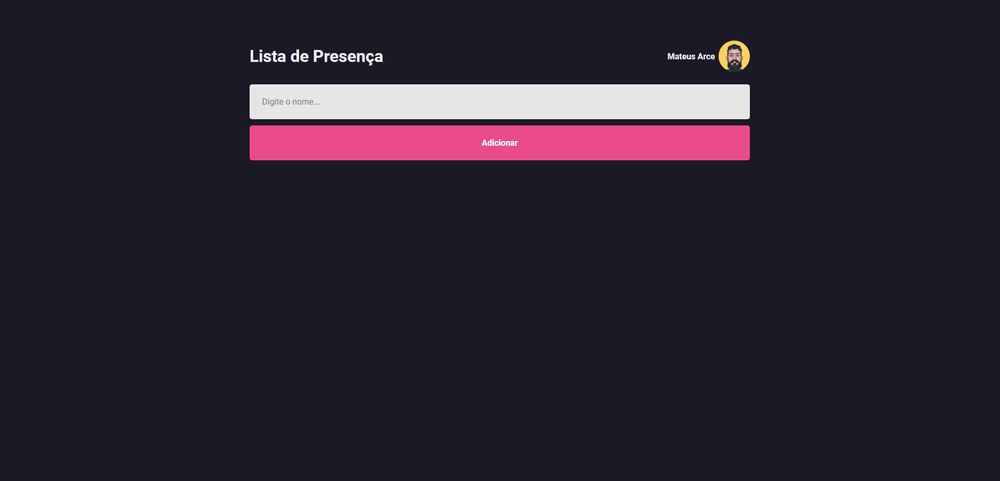

<h1 align="center">
        Lista de Presença
</h1>

<h1 align="center">
    
</h1>

<h3 align="center">Você pode acessar o projeto <a href="https://lista-de-presenca-phi.vercel.app/" target="_blank">clicando aqui</a></h3>

---

</br>

# Sobre o projeto

**Lista de Presença** é o meu primeiro projeto utilizando a biblioteca ReactJS, as aulas do instrutor Rodrigo da Rocketseat foram de grande importância
para mim, pois me permitiram conhecer os fundamentos dessa tecnologia incrível.
</br>
</br>
</br>

# Tecnologias

- [Html](https://www.w3schools.com/html/)
- [Css](https://www.w3schools.com/css/)
- [JavaScript](https://developer.mozilla.org/pt-BR/docs/Web/JavaScript)
- [ReactJS](https://reactjs.org/)

---
</br>

## Como baixar o projeto

```bash
# Clonar o repositório
$ git clone https://github.com/mateusarcedev/lista_de_presenca
# Entrar no diretório
$ cd lista_de_presenca
```

---

<p align="center"> Desenvolvido por <a href="https://www.linkedin.com/in/mateus-arce/">Mateus Arce</a> ✌🏼</p>
